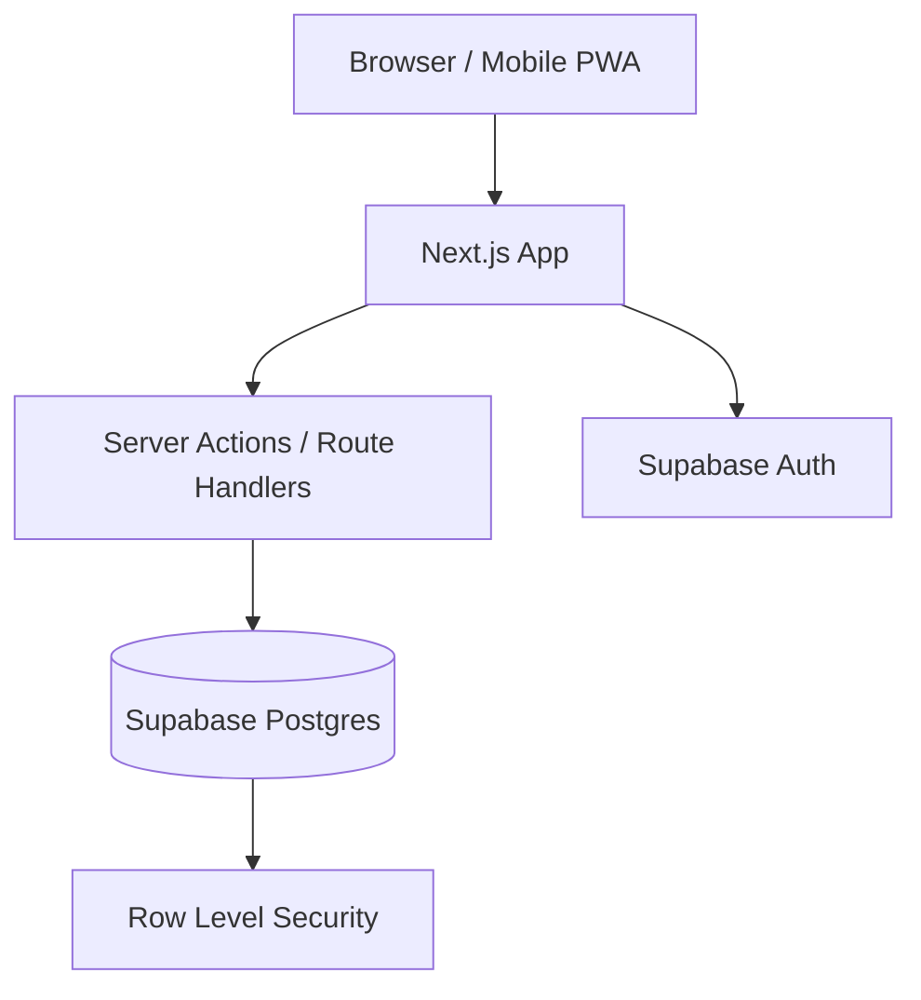

# Planejamento do App de Financas Pessoais

## Visao Geral

Aplicacao web simples, bonita e funcional para registrar receitas e despesas no dia a dia, com foco forte em uso no celular, analise posterior e experiencia premium.

Objetivos principais:

- registrar receitas e despesas rapidamente
- acompanhar saldo do mes
- entender fontes de receita
- entender para onde o dinheiro foi
- usar muito bem no celular como PWA
- manter custo de hospedagem em zero no inicio
- deixar a base pronta para multiusuario no futuro

## Stack Final Fechada

- **App web**: `Next.js 15` + `TypeScript`
- **UI**: `Tailwind CSS v4` + `shadcn/ui`
- **Design system**: tokens com `CSS variables` + tema `light/dark`
- **Backend**: `Next.js App Router` com `Server Actions` e `Route Handlers`
- **Banco**: `PostgreSQL` no `Supabase`
- **Auth**: `Supabase Auth`
- **ORM**: `Drizzle ORM`
- **Validacao**: `Zod`
- **Forms**: `React Hook Form`
- **Graficos**: `Recharts`
- **Tabelas/listas**: `TanStack Table`
- **Deploy**: `Vercel` + `Supabase`
- **Mobile**: `PWA` instalavel no celular

Essa stack entrega:

- custo inicial zero
- visual forte
- boa experiencia de desenvolvimento
- responsividade real para uso diario no celular
- base pronta para multiusuario depois

## Hospedagem Gratuita

Para manter tudo gratuito:

- **Frontend/API**: `Vercel Hobby`
- **Banco/Auth/Storage**: `Supabase Free`

Observacoes:

- os dois possuem limites de free tier
- para uso pessoal e MVP pequeno com futuro multiusuario, sao suficientes
- se crescer, o gargalo inicial mais provavel sera o plano free do Supabase

## Arquitetura

Padrao arquitetural adotado:

- `modular monolith`

Modulos principais:

- `auth`
- `dashboard`
- `entries`
- `categories`
- `reports`
- `settings`
- `shared-ui`

Essa escolha foi feita porque:

- CRUD financeiro nao precisa microservices
- reduz complexidade operacional
- facilita deploy gratuito
- acelera entrega do MVP

## Direcao do Produto

O app sera um produto voltado a:

- captura rapida de receitas e despesas
- historico organizado
- leitura clara do saldo e do fluxo mensal
- analise visual premium depois dos registros

Nao sera, no MVP, um gerenciador financeiro completo com todos os cenarios possiveis.

## Escopo Final do MVP

Incluido no MVP:

1. Login
2. Dashboard mensal
3. CRUD de categorias de receita e despesa
4. CRUD de lancamentos financeiros
5. Filtros por mes
6. Historico de lancamentos
7. Relatorios simples
8. Tema light/dark
9. PWA instalavel

Fora do MVP:

1. transferencias entre contas
2. contas multiplas complexas
3. recorrencia automatica
4. importacao CSV/OFX
5. anexos
6. metas
7. orcamento por categoria
8. parcelamento

## Direcao Visual

Linguagem visual escolhida:

- `minimalista premium`
- `luxuosa`, mas contida
- `glassmorphism moderno`

Principios visuais:

- dark-first
- superficies translucidas elegantes
- blur suave e controlado
- bordas finas frias
- sombras sutis
- destaque forte para valores e saldo
- contraste alto para manter legibilidade

## Paleta e Tipografia

Paleta sugerida:

- fundo: navy/grafite profundo
- superficie: vidro escuro translucido
- primary: azul-violeta sofisticado
- income: verde esmeralda suave
- expense: coral sofisticado
- texto: branco frio e cinza claro

Tipografia:

- interface: `Inter`
- numeros/valores: `JetBrains Mono`

## Categorias Iniciais Padrao

### Receitas

- `Salario`
- `Freelance`
- `Investimentos`
- `Presentes`
- `Reembolsos`
- `Outros`

### Despesas

- `Moradia`
- `Alimentacao`
- `Transporte`
- `Saude`
- `Lazer`
- `Educacao`
- `Assinaturas`
- `Contas`
- `Compras`
- `Impostos`
- `Outros`

## Modelo Final de Dados

Entidades principais:

1. `profiles`
2. `categories`
3. `entries`

### `profiles`

- `id`
- `user_id`
- `display_name`
- `currency`
- `locale`
- `created_at`

### `categories`

- `id`
- `user_id`
- `name`
- `type`
- `color`
- `icon`
- `is_archived`
- `is_default`
- `created_at`

`type`:

- `income`
- `expense`

### `entries`

- `id`
- `user_id`
- `category_id`
- `type`
- `amount_cents`
- `description`
- `notes`
- `entry_date`
- `created_at`
- `updated_at`

`type`:

- `income`
- `expense`

## Regras de Negocio

- `amount_cents` sempre inteiro positivo
- categoria deve ter o mesmo `type` do lancamento
- `entry_date` dirige relatorios
- tudo vinculado a `user_id`
- `description` obrigatoria
- `notes` opcional

## Seguranca e Multiusuario

Mesmo sendo uso pessoal no inicio, o app sera preparado para multiusuario:

- `Supabase Auth`
- `RLS` em todas as tabelas de dominio
- `user_id` em todos os dados do usuario
- policies impedindo leitura e escrita entre usuarios

## Rotas Finais

### Publicas

- `/`
- `/login`

### Privadas

- `/dashboard`
- `/entries`
- `/entries/new`
- `/entries/[id]/edit`
- `/categories`
- `/reports`
- `/settings`

## Funcao de Cada Rota

### `/dashboard`

- saldo do mes
- total de receitas
- total de despesas
- resumo liquido
- graficos
- ultimos lancamentos

### `/entries`

- historico
- filtros por mes, tipo e categoria
- busca por descricao
- editar/excluir

### `/entries/new`

- criacao de lancamento
- no mobile pode abrir como sheet

### `/categories`

- categorias de receita e despesa
- criar, editar, arquivar

### `/reports`

- breakdown por categoria
- receitas por fonte
- tendencia mensal simples

### `/settings`

- perfil
- moeda
- locale
- tema

## Estrutura de Pastas Sugerida

```txt
src/
  app/
    (marketing)/
      page.tsx
    (auth)/
      login/
        page.tsx
      auth/
        callback/
          route.ts
    (app)/
      layout.tsx
      dashboard/
        page.tsx
      entries/
        page.tsx
        new/
          page.tsx
        [id]/
          edit/
            page.tsx
      categories/
        page.tsx
      reports/
        page.tsx
      settings/
        page.tsx
    api/
      pwa/
        manifest/route.ts

  components/
    app-shell/
      app-shell.tsx
      sidebar.tsx
      bottom-nav.tsx
      page-header.tsx
    dashboard/
      balance-hero.tsx
      summary-cards.tsx
      recent-entries.tsx
      expense-category-chart.tsx
      income-source-chart.tsx
    entries/
      entry-form.tsx
      entry-list.tsx
      entry-filters.tsx
      quick-add-sheet.tsx
      entry-card.tsx
    categories/
      category-form.tsx
      category-list.tsx
    reports/
      monthly-trend-chart.tsx
      category-breakdown.tsx
    ui/
      glass-card.tsx
      stat-card.tsx
      amount.tsx
      empty-state.tsx
      loading-skeleton.tsx

  lib/
    auth/
      session.ts
      guards.ts
    db/
      client.ts
      schema/
        profiles.ts
        categories.ts
        entries.ts
      queries/
        dashboard.ts
        entries.ts
        categories.ts
        reports.ts
    validations/
      category.ts
      entry.ts
      settings.ts
    utils/
      currency.ts
      date.ts
      cn.ts
    constants/
      categories.ts
      theme.ts
      routes.ts

  actions/
    categories/
      create-category.ts
      update-category.ts
      archive-category.ts
    entries/
      create-entry.ts
      update-entry.ts
      delete-entry.ts
    settings/
      update-profile.ts
      update-theme.ts

  hooks/
    use-theme.ts
    use-entry-filters.ts

  styles/
    globals.css
    tokens.css
```

## Componentes Prioritarios

1. `GlassCard`
2. `AppShell`
3. `BottomNav`
4. `BalanceHero`
5. `SummaryCards`
6. `QuickAddSheet`
7. `EntryForm`
8. `EntryList`
9. `ExpenseCategoryChart`
10. `IncomeSourceChart`

## Experiencia Mobile

Fluxo principal esperado:

1. abrir app
2. ver saldo do mes
3. tocar em `+`
4. escolher `receita` ou `despesa`
5. preencher valor, categoria e descricao
6. salvar
7. voltar ao dashboard atualizado

Padroes mobile-first:

- bottom nav fixa
- botao flutuante
- formularios em sheet
- cards compactos
- foco em uma acao por vez

## Dashboard Ideal

O dashboard precisa responder rapidamente:

1. quanto entrou este mes
2. quanto saiu este mes
3. quanto sobrou
4. quais foram as maiores categorias de gasto
5. de onde veio a receita

Secoes do dashboard:

1. `Hero de saldo`
2. `Cards de resumo`
3. `Donut de despesas por categoria`
4. `Donut/bar de receitas por fonte`
5. `Lista dos ultimos lancamentos`

## Consultas Principais

O MVP precisa responder bem a:

1. receitas do mes
2. despesas do mes
3. saldo liquido do mes
4. total por categoria de despesa
5. total por categoria de receita
6. ultimos lancamentos
7. historico filtrado
8. tendencia mensal dos ultimos meses

## Indices Iniciais

- `entries(user_id, entry_date desc)`
- `entries(user_id, type, entry_date desc)`
- `entries(user_id, category_id, entry_date desc)`
- `categories(user_id, type, is_archived)`

## Backlog por Sprint

### Sprint 1: Fundacao

1. criar projeto base com Next.js e TypeScript
2. configurar Tailwind, tokens e tema dark/light
3. configurar Supabase Auth
4. estruturar App Router e layout privado
5. definir schema inicial com Drizzle
6. preparar PWA base

### Sprint 2: Categorias e Base de Dados

1. criar tabela `profiles`
2. criar tabela `categories`
3. criar seed de categorias padrao
4. implementar CRUD de categorias
5. validar regras por tipo
6. aplicar RLS nas tabelas

### Sprint 3: Lancamentos

1. criar tabela `entries`
2. implementar formulario de lancamento
3. implementar listagem de lancamentos
4. implementar edicao
5. implementar exclusao
6. adicionar filtros por mes, tipo e categoria

### Sprint 4: Dashboard

1. calcular receitas do mes
2. calcular despesas do mes
3. calcular saldo liquido
4. exibir ultimos lancamentos
5. grafico de despesas por categoria
6. grafico de receitas por fonte

### Sprint 5: Relatorios e Polimento

1. tela de relatorios
2. tendencia mensal
3. melhorar estados vazios
4. skeletons e loading states
5. polimento visual glass premium
6. revisao de responsividade completa

### Sprint 6: Finalizacao do MVP

1. ajustes de PWA
2. icones e manifesto
3. refino de microinteracoes
4. revisao de acessibilidade
5. revisao de performance
6. preparacao para deploy final

## Riscos

1. exagerar no glassmorphism e perder legibilidade
2. deixar o formulario de lancamento lento
3. misturar regras de receita e despesa de forma confusa
4. criar dashboard bonito, mas pouco informativo
5. adiar decisoes de `RLS` e multiusuario

## Mitigacoes

1. contraste alto e blur moderado
2. formulario com poucos campos visiveis
3. categorias tipadas e validacao de consistencia
4. dashboard guiado por perguntas reais do usuario
5. `user_id` e `RLS` desde o comeco

## Ordem Recomendada de Execucao

1. schema
2. autenticacao
3. categorias
4. lancamentos
5. dashboard
6. relatorios
7. PWA
8. polimento visual

## Arquitetura Resumida



## Resumo Final

Produto planejado:

- app web responsivo e PWA
- foco em receitas e despesas
- visual minimalista premium e luxuoso
- glassmorphism moderno
- stack gratuita no inicio
- arquitetura simples e preparada para crescer

Direcao tecnica consolidada:

`Next.js + TypeScript + Tailwind v4 + shadcn/ui + Drizzle + Zod + React Hook Form + Recharts + Supabase (Postgres/Auth) + Vercel + PWA`
