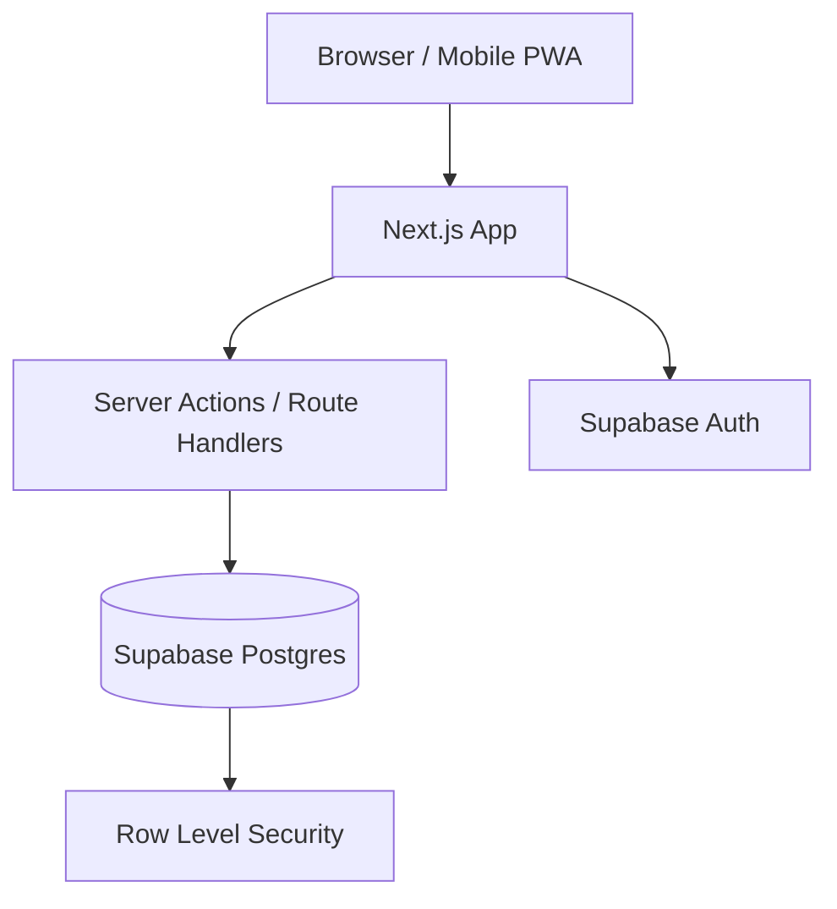

# Stack Final

Para o seu caso, eu fecharia nesta stack:

- **App web**: `Next.js 15` + `TypeScript`
- **UI**: `Tailwind CSS v4` + `shadcn/ui`
- **Design system**: tokens com `CSS variables` + tema `light/dark`
- **Backend**: `Next.js App Router` com `Server Actions` e `Route Handlers`
- **Banco**: `PostgreSQL` no `Supabase`
- **Auth**: `Supabase Auth`
- **ORM**: `Drizzle ORM`
- **Validação**: `Zod`
- **Forms**: `React Hook Form`
- **Gráficos**: `Recharts`
- **Tabelas/listas**: `TanStack Table`
- **Deploy**: `Vercel` + `Supabase`
- **Mobile**: `PWA` instalável no celular

Essa é a minha recomendação final porque entrega:

- custo inicial zero
- excelente DX
- visual forte
- responsividade real para uso diário no celular
- base pronta para multiusuário depois

# Hospedagem Gratuita

Para manter tudo gratuito:

- **Frontend/API**: `Vercel Hobby`
- **Banco/Auth/Storage**: `Supabase Free`

Observações práticas:

- os dois têm limites de free tier
- para uso pessoal e MVP multiusuário pequeno, é suficiente
- se crescer bastante, o primeiro gargalo provavelmente será o plano free do Supabase

# Arquitetura Final

**Padrão**: `modular monolith`

Um único app com módulos internos:

- `auth`
- `dashboard`
- `accounts`
- `transactions`
- `categories`
- `budgets`
- `reports`
- `settings`

Isso é a escolha certa aqui porque:

- CRUD financeiro não precisa microservices
- você quer algo bonito, rápido e prático
- operação precisa ser simples e barata

# Por que essa stack e não outra

1. **Next.js**
   - resolve frontend e backend no mesmo projeto
   - simplifica deploy
   - ótimo para app responsivo e PWA

2. **Supabase**
   - te dá `Postgres + Auth + storage + backups gerenciados`
   - reduz muito trabalho de infraestrutura
   - excelente para evoluir de 1 usuário para vários

3. **PostgreSQL**
   - finanças pessoais pedem integridade e consultas relacionais
   - é melhor escolha que MongoDB para transações, categorias, contas e relatórios

4. **Drizzle**
   - schema tipado
   - migrations claras
   - mais controle do que depender só do dashboard

5. **Tailwind + shadcn/ui**
   - rapidez para construir
   - visual moderno
   - fácil personalizar sem ficar com cara de template genérico

6. **PWA**
   - você abre no celular como se fosse app
   - ícone na tela inicial
   - experiência melhor que só site responsivo
   - continua tudo dentro da hospedagem gratuita

# Direção de Produto

Você disse: "quero algo foda". Então eu não faria um CRUD seco. Eu faria um app com esta proposta:

- visual premium
- mobile-first
- navegação muito rápida
- foco em uso diário com 3 toques no máximo para lançar gasto
- dashboard realmente útil, não só tabelas

# Direção de UX

**Princípios**

- mobile-first desde o início
- lançamento rápido de transação
- leitura clara de saldo e fluxo do mês
- filtros simples
- poucas ações por tela
- bottom navigation no mobile

**Telas principais**

1. `Dashboard`
2. `Transações`
3. `Orçamentos`
4. `Relatórios`
5. `Configurações`

**Componentes-chave**

- `BalanceHero`
- `QuickAddTransaction`
- `MonthlySummaryCards`
- `SpendingByCategoryChart`
- `RecentTransactionsList`
- `BudgetProgressCard`
- `AccountSelector`
- `MonthSwitcher`

# Design System

Eu fecharia o design assim:

- **estilo**: clean premium, com densidade boa para uso frequente
- **tema**: light e dark
- **identidade**: sofisticada, não "app bancário genérico"
- **tipografia**:
  - `Inter` para interface
  - `JetBrains Mono` para valores e números
- **raios**: médios
- **sombras**: suaves
- **cores semânticas**:
  - `income`
  - `expense`
  - `investment`
  - `warning`
  - `success`
  - `surface`
  - `surface-elevated`
  - `text-primary`
  - `text-muted`

**Paleta sugerida**

- base neutra grafite/slate
- verde elegante para receitas
- vermelho controlado para despesas
- azul/violeta para elementos interativos
- modo escuro forte para uso noturno no celular

# Requisitos Não Funcionais

- responsivo real: `360px` até desktop
- carregamento inicial rápido
- p95 de navegação e ações: foco em sensação de fluidez
- autenticação por email magic link
- isolamento por usuário com `RLS`
- suporte a multiusuário desde o schema inicial
- backup/exportação CSV no roadmap curto

# Modelo de Dados Inicial

Eu fecharia com estas entidades:

- `users`
- `profiles`
- `accounts`
- `categories`
- `transactions`
- `budgets`
- `recurring_transactions`
- `tags` opcional
- `attachments` opcional depois

**Campos importantes**

- valores sempre em **centavos inteiros**
- `transaction_date` separado de `created_at`
- `type`: `income | expense | transfer`
- `user_id` em tudo que for dado do usuário
- suporte a `account_id` e `category_id`

# Autenticação e Multiusuário

Mesmo sendo só para você agora, eu prepararia assim:

- login por email
- `profile` separado do usuário de auth
- `RLS` em todas as tabelas de domínio
- cada registro vinculado a `user_id`

Assim depois você pode liberar para outros usuários sem refazer a base.

# Arquitetura Resumida

# ADR Fechadas

## ADR-001: Arquitetura

- **Decisão**: monólito modular
- **Motivo**: menor complexidade, custo zero, entrega rápida
- **Alternativa rejeitada**: microservices

## ADR-002: Banco

- **Decisão**: PostgreSQL
- **Motivo**: ACID, relatórios, integridade financeira
- **Alternativa rejeitada**: MongoDB/Firestore

## ADR-003: Plataforma de dados

- **Decisão**: Supabase
- **Motivo**: free tier, auth embutida, Postgres gerenciado
- **Alternativa rejeitada**: backend próprio + banco separado

## ADR-004: Frontend

- **Decisão**: Next.js
- **Motivo**: full-stack simples, deploy fácil, PWA viável
- **Alternativa rejeitada**: separar React + API independente

## ADR-005: Mobile

- **Decisão**: PWA em vez de app nativo
- **Motivo**: custo zero, manutenção única, suficiente para uso diário
- **Alternativa rejeitada**: React Native/Flutter agora

# Stack Final Fechada em Uma Linha

`Next.js + TypeScript + Tailwind v4 + shadcn/ui + Drizzle + Zod + React Hook Form + Recharts + Supabase (Postgres/Auth) + Vercel + PWA`

# O que eu faria no MVP

1. Login
2. Dashboard
3. CRUD de contas
4. CRUD de categorias
5. CRUD de transações
6. Resumo do mês
7. Gráfico por categoria
8. Filtros por mês/conta/categoria
9. Tema light/dark
10. Instalação como PWA

# Fase 2

1. Orçamentos por categoria
2. Transações recorrentes
3. Importação CSV
4. Anexos de comprovantes
5. Metas financeiras
6. Parcelamento de cartão

# Minha Recomendação Objetiva

Se o objetivo é começar certo, sem custo, com visual forte e excelente uso no celular, essa é a stack correta.

# Próximo Passo

No próximo passo, eu posso te entregar:

1. estrutura de pastas
2. entidades do banco
3. rotas e telas
4. backlog em ordem de implementação
5. wireframe textual da experiência mobile-first
