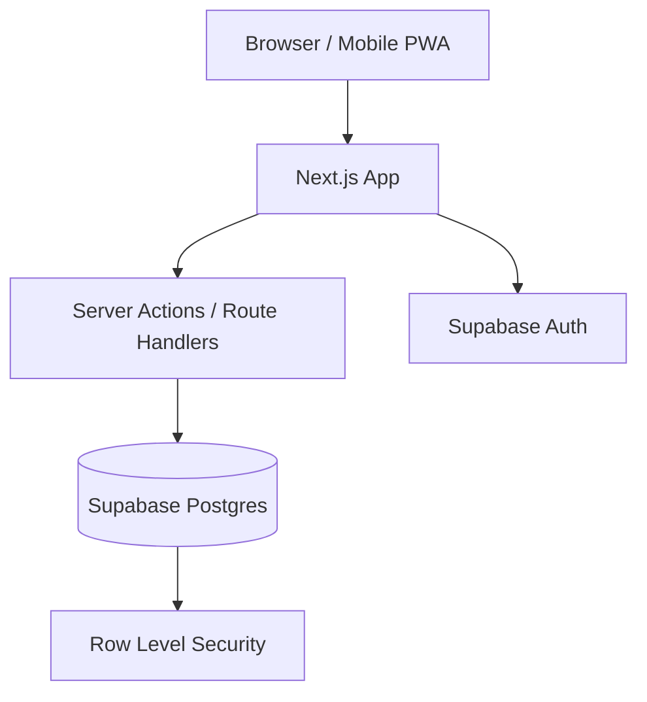

# Personal Finance App Planning

## Overview

A simple, beautiful, and functional web app to log income and expenses day to day, with strong focus on mobile usage, later analysis, and a premium experience.

Main goals:

- log income and expenses quickly
- track the monthly balance
- understand income sources
- understand where money went
- work very well on mobile as a PWA
- keep hosting cost at zero in the beginning
- keep the foundation ready for multi-user support later

## Finalized Stack

- **Web app**: `Next.js 15` + `TypeScript`
- **UI**: `Tailwind CSS v4` + `shadcn/ui`
- **Design system**: tokens with `CSS variables` + `light/dark` theme
- **Backend**: `Next.js App Router` with `Server Actions` and `Route Handlers`
- **Database**: `PostgreSQL` on `Supabase`
- **Auth**: `Supabase Auth`
- **ORM**: `Drizzle ORM`
- **Validation**: `Zod`
- **Forms**: `React Hook Form`
- **Charts**: `Recharts`
- **Tables/lists**: `TanStack Table`
- **Deploy**: `Vercel` + `Supabase`
- **Mobile**: installable `PWA`

This stack delivers:

- zero initial cost
- strong visual quality
- good developer experience
- real mobile responsiveness for daily use
- a base ready for multi-user support later

## Free Hosting

To keep everything free:

- **Frontend/API**: `Vercel Hobby`
- **Database/Auth/Storage**: `Supabase Free`

Notes:

- both have free-tier limits
- for personal use and a small MVP with future multi-user support, they are enough
- if the app grows, the first likely bottleneck will be the Supabase free plan

## Architecture

Chosen architectural pattern:

- `modular monolith`

Main modules:

- `auth`
- `dashboard`
- `entries`
- `categories`
- `reports`
- `settings`
- `shared-ui`

This choice was made because:

- financial CRUD does not need microservices
- it reduces operational complexity
- it makes free deployment easier
- it speeds up MVP delivery

## Product Direction

The app will be a product focused on:

- quick logging of income and expenses
- organized history
- clear reading of monthly balance and cash flow
- premium visual analysis after records are created

In the MVP, it will not be a full financial management tool covering every possible scenario.

## Final MVP Scope

Included in the MVP:

1. Login
2. Monthly dashboard
3. Income and expense categories CRUD
4. Financial entries CRUD
5. Monthly filters
6. Entry history
7. Simple reports
8. Light/dark theme
9. Installable PWA

Out of the MVP:

1. transfers between accounts
2. complex multi-account support
3. automatic recurrence
4. CSV/OFX import
5. attachments
6. goals
7. budget by category
8. installments

## Visual Direction

Chosen visual language:

- `minimal premium`
- `luxurious`, but restrained
- `modern glassmorphism`

Visual principles:

- dark-first
- elegant translucent surfaces
- soft and controlled blur
- thin cool borders
- subtle shadows
- strong emphasis on values and balance
- high contrast to preserve readability

## Palette and Typography

Suggested palette:

- background: deep navy/graphite
- surface: dark translucent glass
- primary: sophisticated blue-violet
- income: soft emerald green
- expense: sophisticated coral
- text: cool white and light gray

Typography:

- interface: `Inter`
- numbers/amounts: `JetBrains Mono`

## Default Initial Categories

### Income

- `Salary`
- `Freelance`
- `Investments`
- `Gifts`
- `Reimbursements`
- `Other`

### Expense

- `Housing`
- `Food`
- `Transport`
- `Health`
- `Leisure`
- `Education`
- `Subscriptions`
- `Bills`
- `Shopping`
- `Taxes`
- `Other`

## Final Data Model

Main entities:

1. `profiles`
2. `categories`
3. `entries`

### `profiles`

- `id`
- `user_id`
- `display_name`
- `currency`
- `locale`
- `created_at`

### `categories`

- `id`
- `user_id`
- `name`
- `type`
- `color`
- `icon`
- `is_archived`
- `is_default`
- `created_at`

`type`:

- `income`
- `expense`

### `entries`

- `id`
- `user_id`
- `category_id`
- `type`
- `amount_cents`
- `description`
- `notes`
- `entry_date`
- `created_at`
- `updated_at`

`type`:

- `income`
- `expense`

## Business Rules

- `amount_cents` is always a positive integer
- category must have the same `type` as the entry
- `entry_date` drives reports
- everything is linked to `user_id`
- `description` is required
- `notes` is optional

## Security and Multi-User

Even though the app starts as personal use, it will be prepared for multi-user support:

- `Supabase Auth`
- `RLS` on all domain tables
- `user_id` on all user-owned data
- policies preventing cross-user reads and writes

## Final Routes

### Public

- `/`
- `/login`

### Private

- `/dashboard`
- `/entries`
- `/entries/new`
- `/entries/[id]/edit`
- `/categories`
- `/reports`
- `/settings`

## Purpose of Each Route

### `/dashboard`

- monthly balance
- total income
- total expenses
- net summary
- charts
- recent entries

### `/entries`

- history
- filters by month, type, and category
- description search
- edit/delete

### `/entries/new`

- entry creation
- on mobile it may later open as a sheet

### `/categories`

- income and expense categories
- create, edit, archive

### `/reports`

- category breakdown
- income by source
- simple monthly trend

### `/settings`

- profile
- currency
- locale
- theme

## Suggested Folder Structure

```txt
src/
  app/
    (marketing)/
      page.tsx
    (auth)/
      login/
        page.tsx
      auth/
        callback/
          route.ts
    (app)/
      layout.tsx
      dashboard/
        page.tsx
      entries/
        page.tsx
        new/
          page.tsx
        [id]/
          edit/
            page.tsx
      categories/
        page.tsx
      reports/
        page.tsx
      settings/
        page.tsx
    api/
      pwa/
        manifest/route.ts

  components/
    app-shell/
      app-shell.tsx
      sidebar.tsx
      bottom-nav.tsx
      page-header.tsx
    dashboard/
      balance-hero.tsx
      summary-cards.tsx
      recent-entries.tsx
      expense-category-chart.tsx
      income-source-chart.tsx
    entries/
      entry-form.tsx
      entry-list.tsx
      entry-filters.tsx
      quick-add-sheet.tsx
      entry-card.tsx
    categories/
      category-form.tsx
      category-list.tsx
    reports/
      monthly-trend-chart.tsx
      category-breakdown.tsx
    ui/
      glass-card.tsx
      stat-card.tsx
      amount.tsx
      empty-state.tsx
      loading-skeleton.tsx

  lib/
    auth/
      session.ts
      guards.ts
    db/
      client.ts
      schema/
        profiles.ts
        categories.ts
        entries.ts
      queries/
        dashboard.ts
        entries.ts
        categories.ts
        reports.ts
    validations/
      category.ts
      entry.ts
      settings.ts
    utils/
      currency.ts
      date.ts
      cn.ts
    constants/
      categories.ts
      theme.ts
      routes.ts

  actions/
    categories/
      create-category.ts
      update-category.ts
      archive-category.ts
    entries/
      create-entry.ts
      update-entry.ts
      delete-entry.ts
    settings/
      update-profile.ts
      update-theme.ts

  hooks/
    use-theme.ts
    use-entry-filters.ts

  styles/
    globals.css
    tokens.css
```

## Priority Components

1. `GlassCard`
2. `AppShell`
3. `BottomNav`
4. `BalanceHero`
5. `SummaryCards`
6. `QuickAddSheet`
7. `EntryForm`
8. `EntryList`
9. `ExpenseCategoryChart`
10. `IncomeSourceChart`

## Mobile Experience

Expected main flow:

1. open app
2. see monthly balance
3. tap `+`
4. choose `income` or `expense`
5. fill amount, category, and description
6. save
7. return to updated dashboard

Mobile-first patterns:

- fixed bottom nav
- floating action button
- sheet-based forms
- compact cards
- focus on one action at a time

## Ideal Dashboard

The dashboard needs to quickly answer:

1. how much came in this month
2. how much went out this month
3. how much is left
4. which spending categories were the largest
5. where income came from

Dashboard sections:

1. `Balance hero`
2. `Summary cards`
3. `Expense donut by category`
4. `Income donut/bar by source`
5. `Recent entries list`

## Core Queries

The MVP needs to answer well:

1. monthly income
2. monthly expenses
3. monthly net balance
4. expense total by category
5. income total by category
6. recent entries
7. filtered history
8. monthly trend over recent months

## Initial Indexes

- `entries(user_id, entry_date desc)`
- `entries(user_id, type, entry_date desc)`
- `entries(user_id, category_id, entry_date desc)`
- `categories(user_id, type, is_archived)`

## Sprint Backlog

### Sprint 1: Foundation

1. create base project with Next.js and TypeScript
2. configure Tailwind, tokens, and dark/light theme
3. configure Supabase Auth
4. structure App Router and private layout
5. define initial schema with Drizzle
6. prepare base PWA

### Sprint 2: Categories and Data Layer

1. create `profiles` table
2. create `categories` table
3. create default category seed
4. implement categories CRUD
5. validate rules by type
6. apply RLS to the tables

### Sprint 3: Entries

1. create `entries` table
2. implement entry form
3. implement entries list
4. implement editing
5. implement deletion
6. add filters by month, type, and category

### Sprint 4: Dashboard

1. calculate monthly income
2. calculate monthly expenses
3. calculate net balance
4. display recent entries
5. expense chart by category
6. income chart by source

### Sprint 5: Reports and Polish

1. reports screen
2. monthly trend
3. improve empty states
4. skeletons and loading states
5. premium glass visual polish
6. full responsiveness review

### Sprint 6: MVP Finalization

1. PWA adjustments
2. icons and manifest
3. microinteraction refinement
4. accessibility review
5. performance review
6. final deployment preparation

## Risks

1. overdoing glassmorphism and losing readability
2. making the entry form slow
3. mixing income and expense rules in a confusing way
4. building a beautiful dashboard that is not very informative
5. postponing `RLS` and multi-user decisions

## Mitigations

1. high contrast and moderate blur
2. form with few visible fields
3. typed categories and consistency validation
4. dashboard driven by real user questions
5. `user_id` and `RLS` from the start

## Recommended Execution Order

1. schema
2. authentication
3. categories
4. entries
5. dashboard
6. reports
7. PWA
8. visual polish

## Architecture Summary



## Final Summary

Planned product:

- responsive web app and PWA
- focused on income and expenses
- minimal premium and luxurious visual language
- modern glassmorphism
- free stack at the beginning
- simple architecture ready to grow

Consolidated technical direction:

`Next.js + TypeScript + Tailwind v4 + shadcn/ui + Drizzle + Zod + React Hook Form + Recharts + Supabase (Postgres/Auth) + Vercel + PWA`
