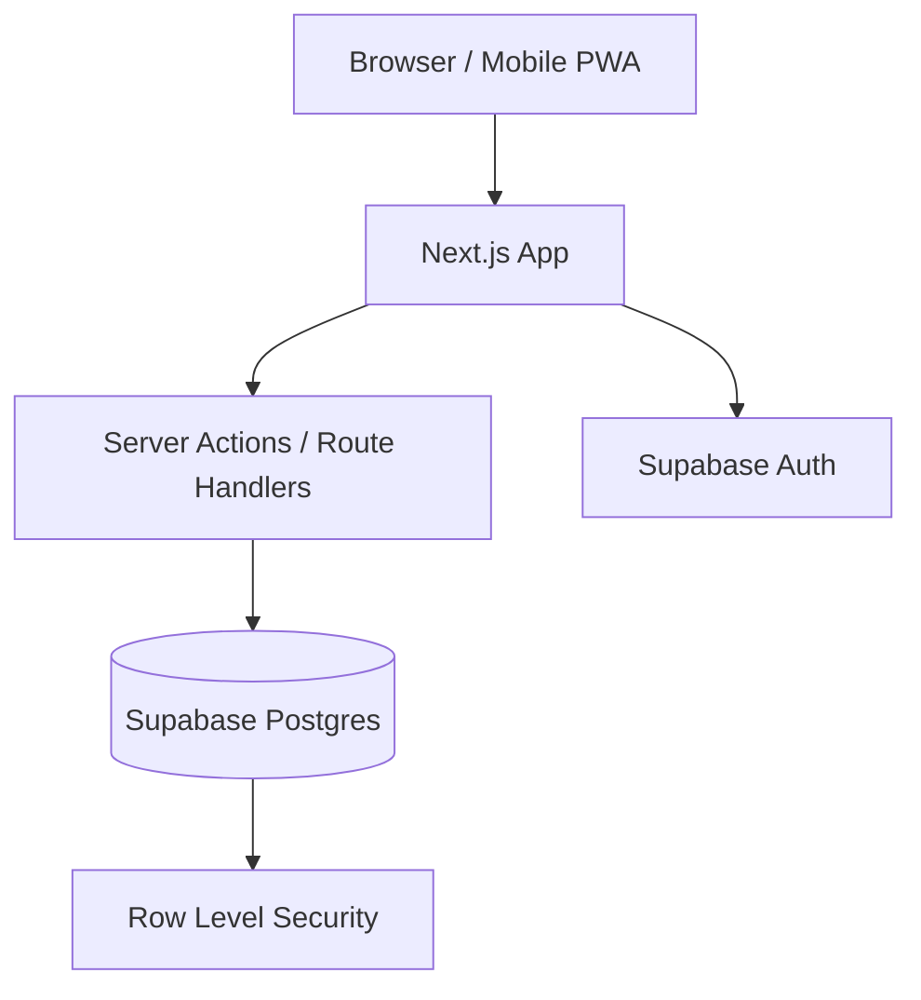

# Final Stack

For your case, this is the stack I would lock in:

- **Web app**: `Next.js 15` + `TypeScript`
- **UI**: `Tailwind CSS v4` + `shadcn/ui`
- **Design system**: tokens with `CSS variables` + `light/dark` theme
- **Backend**: `Next.js App Router` with `Server Actions` and `Route Handlers`
- **Database**: `PostgreSQL` on `Supabase`
- **Auth**: `Supabase Auth`
- **ORM**: `Drizzle ORM`
- **Validation**: `Zod`
- **Forms**: `React Hook Form`
- **Charts**: `Recharts`
- **Tables/lists**: `TanStack Table`
- **Deploy**: `Vercel` + `Supabase`
- **Mobile**: installable `PWA`

This is my final recommendation because it delivers:

- zero initial infrastructure cost
- excellent DX
- strong visual quality
- real responsiveness for daily mobile use
- a foundation that can support multiple users later

# Free Hosting

To keep everything free:

- **Frontend/API**: `Vercel Hobby`
- **Database/Auth/Storage**: `Supabase Free`

Practical notes:

- both have free-tier limits
- for personal use and a small multi-user MVP, they are enough
- if the app grows a lot, the first bottleneck will probably be the Supabase free plan

# Final Architecture

**Pattern**: `modular monolith`

A single app with internal modules:

- `auth`
- `dashboard`
- `accounts`
- `transactions`
- `categories`
- `budgets`
- `reports`
- `settings`

This is the right choice here because:

- financial CRUD does not need microservices
- you want something beautiful, fast, and practical
- operations need to stay simple and cheap

# Why This Stack and Not Another

1. **Next.js**
   - handles frontend and backend in the same project
   - simplifies deployment
   - works very well for responsive apps and PWAs

2. **Supabase**
   - gives you `Postgres + Auth + storage + managed backups`
   - removes a lot of infrastructure work
   - scales very well from one user to many

3. **PostgreSQL**
   - personal finance apps need integrity and relational queries
   - it is a better fit than MongoDB for transactions, categories, accounts, and reporting

4. **Drizzle**
   - typed schema
   - clear migrations
   - more control than depending only on the dashboard

5. **Tailwind + shadcn/ui**
   - fast to build with
   - modern visual language
   - easy to customize without looking like a generic template

6. **PWA**
   - opens on mobile like an app
   - can be added to the home screen
   - better experience than a plain responsive site
   - stays inside the free hosting model

# Product Direction

You said: "I want something great." So I would not build a dry CRUD app. I would build an app with this positioning:

- premium visual quality
- mobile-first
- very fast navigation
- focused on daily use with at most 3 taps to log an expense
- a dashboard that is actually useful, not just tables

# UX Direction

**Principles**

- mobile-first from day one
- quick transaction entry
- clear reading of balance and monthly cash flow
- simple filters
- few actions per screen
- bottom navigation on mobile

**Main screens**

1. `Dashboard`
2. `Transactions`
3. `Budgets`
4. `Reports`
5. `Settings`

**Key components**

- `BalanceHero`
- `QuickAddTransaction`
- `MonthlySummaryCards`
- `SpendingByCategoryChart`
- `RecentTransactionsList`
- `BudgetProgressCard`
- `AccountSelector`
- `MonthSwitcher`

# Design System

I would lock the design like this:

- **style**: clean premium, with good density for frequent use
- **theme**: light and dark
- **identity**: sophisticated, not a generic banking app
- **typography**:
  - `Inter` for interface
  - `JetBrains Mono` for values and numbers
- **radii**: medium
- **shadows**: soft
- **semantic colors**:
  - `income`
  - `expense`
  - `investment`
  - `warning`
  - `success`
  - `surface`
  - `surface-elevated`
  - `text-primary`
  - `text-muted`

**Suggested palette**

- graphite/slate neutral base
- elegant green for income
- controlled red for expenses
- blue/violet for interactive elements
- strong dark mode for nighttime mobile use

# Non-Functional Requirements

- true responsiveness: `360px` up to desktop
- fast initial load
- navigation/action p95 focused on fluidity perception
- magic-link email authentication
- per-user isolation with `RLS`
- multi-user support from the initial schema
- CSV backup/export on the short-term roadmap

# Initial Data Model

I would start with these entities:

- `users`
- `profiles`
- `accounts`
- `categories`
- `transactions`
- `budgets`
- `recurring_transactions`
- optional `tags`
- optional `attachments` later

**Important fields**

- values always stored as **integer cents**
- `transaction_date` separate from `created_at`
- `type`: `income | expense | transfer`
- `user_id` on every user-owned row
- support for `account_id` and `category_id`

# Authentication and Multi-User

Even if this is only for you right now, I would prepare it like this:

- email login
- `profile` separated from auth user
- `RLS` on all domain tables
- each record linked to `user_id`

That way you can open the app to other users later without rebuilding the foundation.

# Architecture Summary

# Finalized ADRs

## ADR-001: Architecture

- **Decision**: modular monolith
- **Reason**: lower complexity, zero initial cost, faster delivery
- **Rejected alternative**: microservices

## ADR-002: Database

- **Decision**: PostgreSQL
- **Reason**: ACID guarantees, reporting, financial integrity
- **Rejected alternative**: MongoDB/Firestore

## ADR-003: Data Platform

- **Decision**: Supabase
- **Reason**: free tier, built-in auth, managed Postgres
- **Rejected alternative**: custom backend + separate database

## ADR-004: Frontend

- **Decision**: Next.js
- **Reason**: simple full-stack setup, easy deployment, viable PWA
- **Rejected alternative**: separate React frontend + independent API

## ADR-005: Mobile

- **Decision**: PWA instead of native app
- **Reason**: zero cost, single codebase, good enough for daily use
- **Rejected alternative**: React Native/Flutter right now

# Final Stack in One Line

`Next.js + TypeScript + Tailwind v4 + shadcn/ui + Drizzle + Zod + React Hook Form + Recharts + Supabase (Postgres/Auth) + Vercel + PWA`

# What I Would Build in the MVP

1. Login
2. Dashboard
3. Accounts CRUD
4. Categories CRUD
5. Transactions CRUD
6. Monthly summary
7. Category chart
8. Month/account/category filters
9. Light/dark theme
10. PWA installation

# Phase 2

1. Category budgets
2. Recurring transactions
3. CSV import
4. Receipt attachments
5. Financial goals
6. Credit card installment handling

# My Objective Recommendation

If the goal is to start correctly, with zero infrastructure cost, strong visual quality, and excellent mobile usability, this is the right stack.

# Next Step

In the next step, I can deliver:

1. folder structure
2. database entities
3. routes and screens
4. backlog in implementation order
5. a text wireframe of the mobile-first experience
